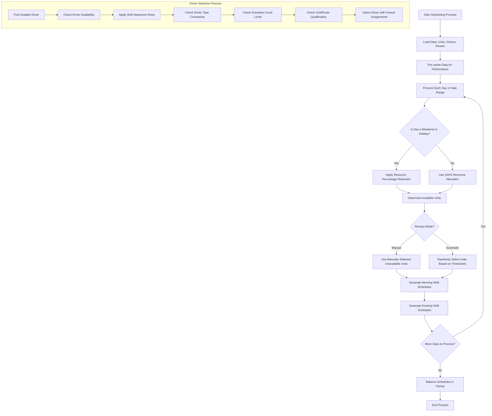

# Jaklingko Presensi - Driver Scheduling System

<p align="center"><a href="https://laravel.com" target="_blank"></a></p>

<p align="center">
<a href="https://github.com/laravel/framework/actions"></a>
<a href="https://packagist.org/packages/laravel/framework"></a>
<a href="https://packagist.org/packages/laravel/framework"></a>
<a href="https://packagist.org/packages/laravel/framework"></a>
</p>

## Driver Scheduling System

The Jaklingko Presensi application includes a sophisticated driver scheduling system designed to efficiently allocate drivers to units while adhering to specific business rules and constraints. This document outlines the scheduling process flow and key components.

### Scheduling Process Flow Diagram



### Key Components

#### 1. Period-Based Scheduling
Schedules are generated with separate thresholds for two periods in each month:
- **First Period**: Days 1-15
- **Second Period**: Days 16-end of the month

#### 2. Driver Types and Thresholds
- **Batangan (Fixed) Drivers**:
  - Minimum 13, Maximum 14 schedules per period
  - Assigned to specific units or routes

- **Cadangan (Non-Fixed) Drivers**:
  - Minimum 11, Maximum 12 schedules per period
  - Can be assigned to any unit they're qualified for

#### 3. Renops Settings
Controls which units operate on weekends and holidays:
- **Manual Mode**: Administrators select which units will not operate
- **Automatic Mode**: System randomly selects units based on thresholds

#### 4. Resource Allocation by Day Type
- **Weekdays**: 100% of units
- **Saturday**: 80% of units
- **Sunday**: 70% of units
- **Holidays**: 70% of units

#### 5. Shift Sequence Rules
- If today is 'Pagi' (morning), the next day can be 'Pagi' or 'Siang' (afternoon)
- If today is 'Siang', tomorrow can only be 'Siang'
- If today is 'Siang' and tomorrow is off, the day after can be either 'Pagi' or 'Siang'

### Performance Optimizations

The scheduling system implements several optimizations to handle large date ranges efficiently:

1. **Data Pre-caching**: Unit assignments, route assignments, existing schedules, and leave requests are pre-loaded
2. **Batch Processing**: Schedules are processed and committed in batches to prevent memory issues
3. **Static Caching**: Repeated database queries are eliminated using static caches
4. **Transaction Management**: Database transactions ensure data integrity during the process

### Usage

The scheduling system can be triggered through the admin interface or via the Schedule model's `autoGenerate` method:

```php
$results = Schedule::autoGenerate('2025-05-01', '2025-05-15');
```

## About Laravel

Laravel is a web application framework with expressive, elegant syntax. We believe development must be an enjoyable and creative experience to be truly fulfilling. Laravel takes the pain out of development by easing common tasks used in many web projects, such as:

- [Simple, fast routing engine](https://laravel.com/docs/routing).
- [Powerful dependency injection container](https://laravel.com/docs/container).
- Multiple back-ends for [session](https://laravel.com/docs/session) and [cache](https://laravel.com/docs/cache) storage.
- Expressive, intuitive [database ORM](https://laravel.com/docs/eloquent).
- Database agnostic [schema migrations](https://laravel.com/docs/migrations).
- [Robust background job processing](https://laravel.com/docs/queues).
- [Real-time event broadcasting](https://laravel.com/docs/broadcasting).

Laravel is accessible, powerful, and provides tools required for large, robust applications.

## Learning Laravel

Laravel has the most extensive and thorough [documentation](https://laravel.com/docs) and video tutorial library of all modern web application frameworks, making it a breeze to get started with the framework.

You may also try the [Laravel Bootcamp](https://bootcamp.laravel.com), where you will be guided through building a modern Laravel application from scratch.

If you don't feel like reading, [Laracasts](https://laracasts.com) can help. Laracasts contains thousands of video tutorials on a range of topics including Laravel, modern PHP, unit testing, and JavaScript. Boost your skills by digging into our comprehensive video library.

## Laravel Sponsors

We would like to extend our thanks to the following sponsors for funding Laravel development. If you are interested in becoming a sponsor, please visit the [Laravel Partners program](https://partners.laravel.com).

### Premium Partners

- **[Vehikl](https://vehikl.com/)**
- **[Tighten Co.](https://tighten.co)**
- **[Kirschbaum Development Group](https://kirschbaumdevelopment.com)**
- **[64 Robots](https://64robots.com)**
- **[Curotec](https://www.curotec.com/services/technologies/laravel/)**
- **[DevSquad](https://devsquad.com/hire-laravel-developers)**
- **[Redberry](https://redberry.international/laravel-development/)**
- **[Active Logic](https://activelogic.com)**

## Contributing

Thank you for considering contributing to the Laravel framework! The contribution guide can be found in the [Laravel documentation](https://laravel.com/docs/contributions).

## Code of Conduct

In order to ensure that the Laravel community is welcoming to all, please review and abide by the [Code of Conduct](https://laravel.com/docs/contributions#code-of-conduct).

## Security Vulnerabilities

If you discover a security vulnerability within Laravel, please send an e-mail to Taylor Otwell via [taylor@laravel.com](mailto:taylor@laravel.com). All security vulnerabilities will be promptly addressed.

## License

The Laravel framework is open-sourced software licensed under the [MIT license](https://opensource.org/licenses/MIT).
