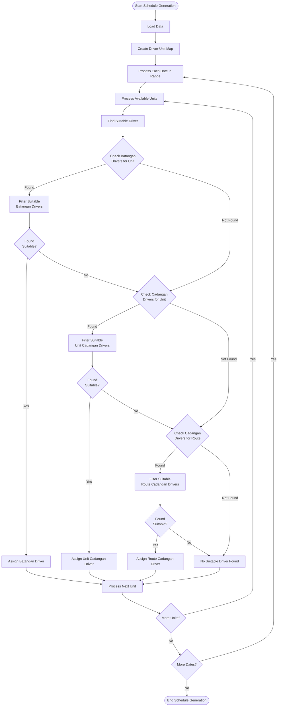
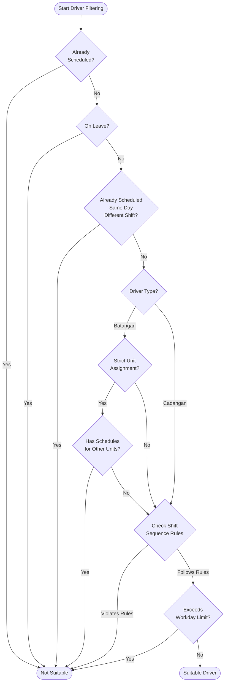
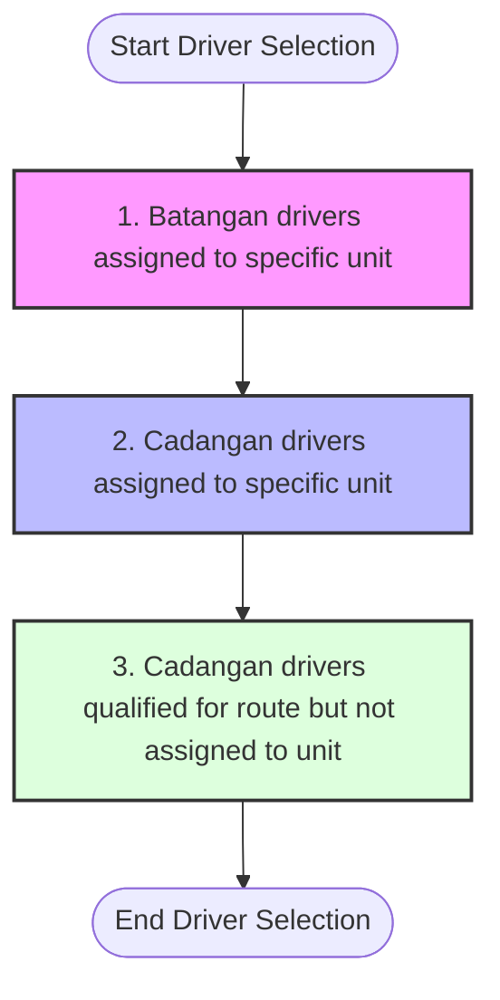
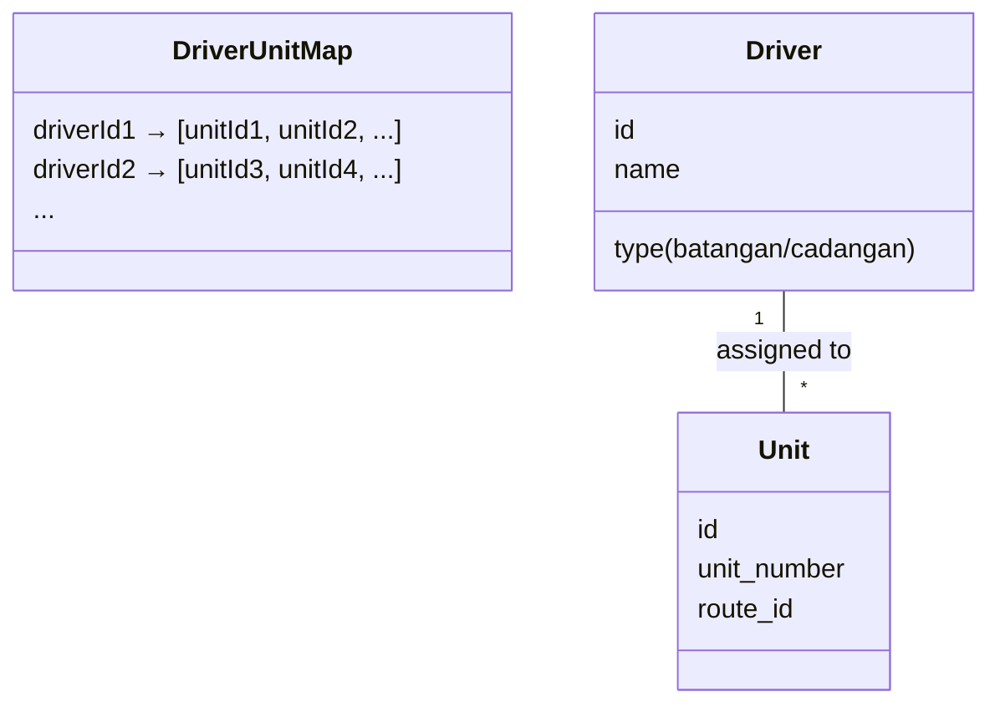
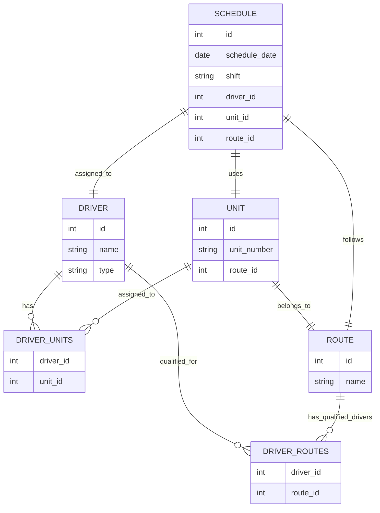

# Driver Assignment Process Flow

## Overview Diagram

## Driver Filtering Process

## Priority System for Driver Assignment

## Driver-Unit Assignment Map Structure

## Data Model Relationships

