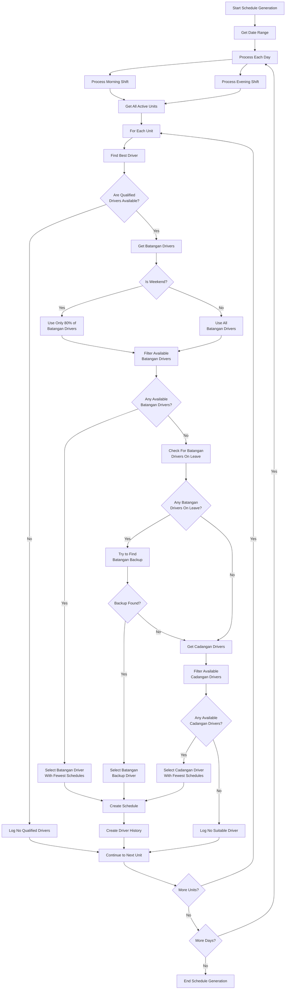

# Schedule Auto-Generation Process Flow

This document outlines the process flow for automatically generating driver schedules, including the criteria for driver selection and assignment.

## Driver Selection Priority

The system prioritizes driver selection as follows:

1. **Batangan Drivers**: These are the primary drivers and are always assigned first if available
2. **Cadangan Drivers**: These are backup drivers and are only assigned if no suitable batangan drivers are available

## Flow Diagram

## Driver Selection Criteria

### Availability Check

A driver is considered available if:

1. The driver is active (status = 'aktif')
2. The driver is not on approved leave for the scheduled date
3. The driver is not already assigned to the same shift on the same date
4. For morning shifts: the driver did not work an evening shift the previous day

### Weekend Handling

On weekends (Saturday and Sunday):
- Only 80% of batangan drivers are considered to ensure rotation
- Drivers with the fewest schedules in the current month are prioritized

### Shift Sequence Constraint

To ensure driver rest periods:
- A driver cannot be assigned to a morning shift if they worked an evening shift the previous day

### Driver Load Balancing

- Drivers are sorted by the number of schedules they have in the current month
- The driver with the fewest schedules is selected to ensure fair distribution

## Error Handling

The system includes robust error handling:
- Logs detailed information about each step of the process
- Records success and failure counts
- Provides detailed error messages for troubleshooting
- Uses database transactions to ensure data integrity

## Status Tracking

Each generated schedule is created with a status of 'scheduled' and can later be updated to:
- 'completed': When the shift is completed
- 'absent': If the driver doesn't show up
- 'on_leave': If the driver is on approved leave
